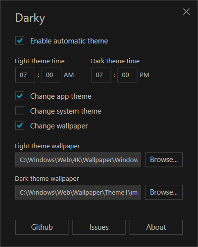

# Darky

A super lightweight dark mode automatic switcher for Windows 10

## Install

You can download and install the latest installer from [here](https://github.com/adrianmteo/Darky/releases).

## Description

This is a super lightweight app built using C# and WPF technologies. It creates task schedules for light/dark theme times. There are no running processes in the background and there is not need to start when Windows starts.

## Command line parameters

| Parameter | Description                                             |
| --------- | ------------------------------------------------------- |
| `/light`  | Switches to the light theme based on the saved settings |
| `/dark`   | Switches to the dark theme based on the saved settings  |
| `/clean`  | Cleans all task schedules created by the app            |
