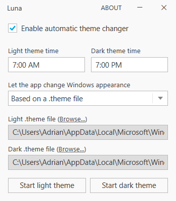
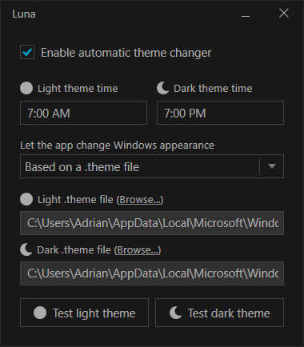
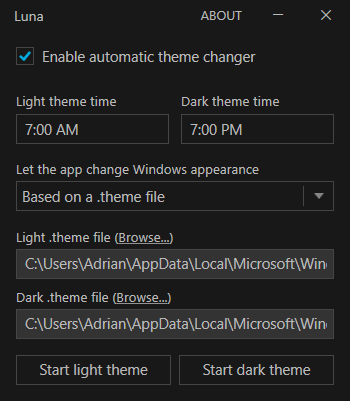
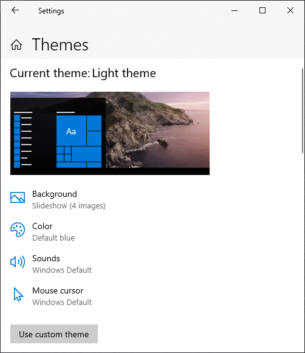
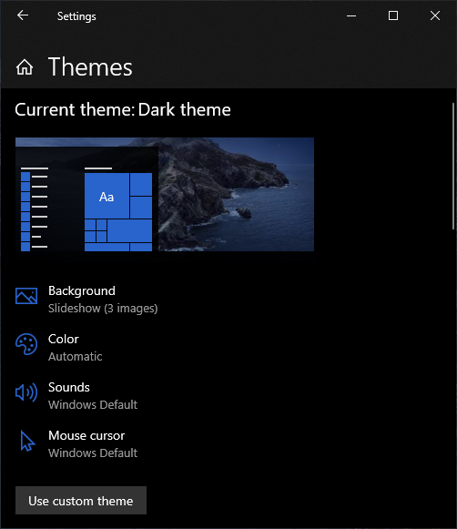
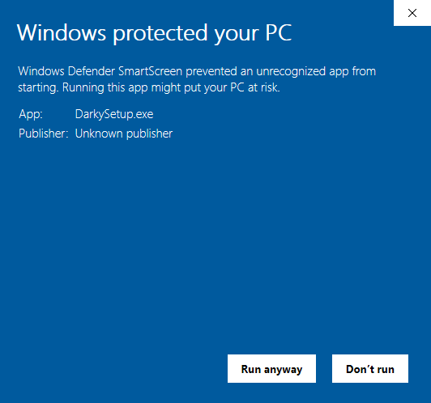

# Luna

A super lightweight automatic theme changer for Windows 10

## Features

- 🎉 Change Window light/dark theme based on set times
- 🎉 Change the Windows theme to a custom theme (see image below) and this includes changing:
  - Background (image, slideshow or solid color)
  - Colors
  - Sounds
  - Mouse cursor
  -  
- 🎉 Change system or app color theme
- 🎉 Change wallpaper for light/dark theme

## Install

You can download and install the latest release from [here](https://github.com/adrianmteo/Luna/releases).

**Note:** Windows SmartScreen might show you this warning screen. This is because the setup file is not being signed but the app is 100% safe to be run.

## Description

I've built this app in my spare time to resolve my frustration with Windows 10 for not having automatic dark theme switcher. This may be included in the next releases of Windows 10 but for now here is Luna!

This is a super lightweight app built using C# and WPF technologies. It creates task schedules for light/dark theme times. There are no running processes in the background and there is not need to start when Windows starts.

3rd party libraries used:

- [Infragistics Metro Light and Dark Theme for WPF](https://www.infragistics.com/community/blogs/b/blagunas/posts/free-metro-light-and-dark-themes-for-wpf-and-silverlight-microsoft-controls)
- [TaskScheduler](https://github.com/dahall/taskscheduler)
- [Extended WPF Toolkit](https://github.com/xceedsoftware/wpftoolkit)
- ThemeTool.exe - a Windows internal theme testing program used to change the Windows theme

## Command line parameters

| Parameter | Description                                             |
| --------- | ------------------------------------------------------- |
| `/light`  | Switches to the light theme based on the saved settings |
| `/dark`   | Switches to the dark theme based on the saved settings  |
| `/update` | Silently checks for an update and installs it           |
| `/clean`  | Cleans all task schedules created by the app            |

## Build

Clone and open the solution in Visual Studio. Right-click on the project and click `Restore NuGet Packages`.

If you want to build the `Release` configuration and generate the setup executable (which is done automatically by building the `Release` configuration) you need to download and install [Inno Setup](https://jrsoftware.org/isinfo.php). The output setup executable can be found under `.extra\Output`.

## Future plans

As time passes I might add new features (or contributions) to complete an experience that Windows 10 doesn't have (yet).

## Contributions

To make this app better for everyone, feel free to contribute with ideas, bug reports or even better: pull requests :)
