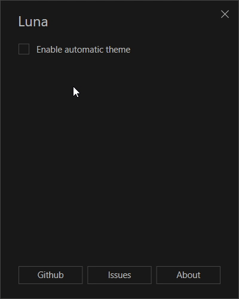

# Darky

A super lightweight dark mode automatic switcher for Windows 10

**Features**

- Set light/dark theme activation times
- Toggle app/system theme based on activation times
- Change wallpaper to light/dark activation times

## Install

You can download and install the latest release from [here](https://github.com/adrianmteo/Darky/releases).

**Note:** Windows SmartScreen might show you this warning screen. This is because the setup file is not being signed but the app is 100% safe to be run.

## Description

I've built this app in my spare time to resolve my frustration with Windows 10 for not having automatic dark theme switcher. This may be included in the next releases of Windows 10 but for now here is Darky!

This is a super lightweight app built using C# and WPF technologies. It creates task schedules for light/dark theme times. There are no running processes in the background and there is not need to start when Windows starts.

3rd party libraries used:
- [Infragistics Metro Light and Dark Theme for WPF](https://www.infragistics.com/community/blogs/b/blagunas/posts/free-metro-light-and-dark-themes-for-wpf-and-silverlight-microsoft-controls)
- [TaskScheduler](https://github.com/dahall/taskscheduler)

## Command line parameters

| Parameter | Description                                             |
| --------- | ------------------------------------------------------- |
| `/light`  | Switches to the light theme based on the saved settings |
| `/dark`   | Switches to the dark theme based on the saved settings  |
| `/clean`  | Cleans all task schedules created by the app            |

## Future plans

As time passes I might add new features (or contributions) to complete an experience that Windows 10 doesn't have (yet).

## Contributions

To make this app better for everyone, feel free to contribute with ideas, bug reports or even better: pull requests :)
